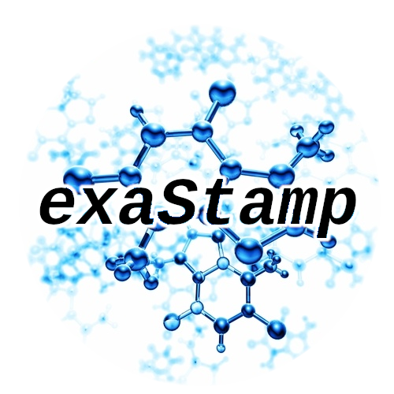

  

This is the **exaStamp** software package, a high performance molecular dynamics simulation code, originated at CEA/DAM. **exaStamp** stands for **S**imulations **T**emporelles **A**tomistiques et **M**oléculaires **P**arallèles à l'**exa**scale (in French) or **exa**scale **S**imulations of **T**ime-dependent **A**tomistic and **M**olecular systems in **P**arallel (in English). This software is distributed under the Apache 2.0 public license.

-----------------------------------------------------------------------------------------------------------

**exaStamp** is a high performance classical molecular dynamics simulation code designed to run efficiently on supercomputers as well as laptops or workstations. It takes advantage of hybrid parallelism with the ability to run using MPI + X where X is either OpenMP or Cuda/HIP. **exaStamp** is the result of a long-time effort at CEA/DAM/DIF, France. It is an open-source code, distributed freely under the terms of the Apache Public License version 2.0.

-----------------------------------------------------------------------------------------------------------

## Documentation

**exaStamp** documentation can be accessed using the following QR code and URls (Website and Documentation git repository.

  <table>
    <tr>
      <td></td>
      <td><a href="https://collab4exanbody.github.io/doc_exaStamp"> exaStamp Website</a> <a href="https://github.com/Collab4exaNBody/doc_exaStamp.git"> exaStamp Documentation </a></td>
    </tr>
  </table>

Main sections of the documentation can be accessed directly using the following URLs.

| URL | Short description |
|-----|-------------|
| https://collab4exanbody.github.io/doc_exaStamp/project_exaStamp/1_Background.html | **exaStamp** background |
| https://collab4exanbody.github.io/doc_exaStamp/project_exaStamp/2_Build_and_Install.html | Build and installation instructions |
| https://collab4exanbody.github.io/doc_exaStamp/project_exaStamp/3_Beginners_guide.html | Beginner's guide |
| https://collab4exanbody.github.io/doc_exaStamp/project_exaStamp/Tutorials.html | Tutorials |
| https://collab4exanbody.github.io/doc_exaStamp/project_exaStamp/4_Domain_Regions.html | Simulation domain and spatial regions |
| https://collab4exanbody.github.io/doc_exaStamp/project_exaStamp/5_Grids.html | Manipulating grids |
| https://collab4exanbody.github.io/doc_exaStamp/project_exaStamp/6_Particles.html | Manipulating particles |
| https://collab4exanbody.github.io/doc_exaStamp/project_exaStamp/7_Interactions.html | Interatomic potentials |
| https://collab4exanbody.github.io/doc_exaStamp/project_exaStamp/8_Constraints.html | Thermodynamic ensembles and constraints |
| https://collab4exanbody.github.io/doc_exaStamp/project_exaStamp/3bis_microStamp.html | microStamp mini MD application |

-----------------------------------------------------------------------------------------------------------

## Community Guidelines

For more details, see `CONTRIBUTING.md`. Main guidelines are:

- For any bug, please create an issue and add the label “bug”. We welcome all feedback to make **exaStamp** as robust as possible.
- If you would like to participate and add functionality to **exaStamp**, you can find instructions for coding style, tests and pull request process in CONTRIBUTING.md.
- If you have any support-related / collaboration questions, please contact the team at pauk.lafourcade@cea.fr. If you are a `CEA` member, please request access to the group : "exaNBody & Co. (exaStamp, exaDEM, exaSPH)", an external access can also be provided.

-----------------------------------------------------------------------------------------------------------

## Authors

### Main developers

- Paul Lafourcade (CEA/DAM) (paul.lafourcade@cea.fr)
- Thierry Carrard (CEA/DAM)

### Other Developers

- Raphaël Prat (CEA/DES)
- Claire Lemarchand (CEA/DAM)

-----------------------------------------------------------------------------------------------------------

## License

See `LICENSE.txt`
